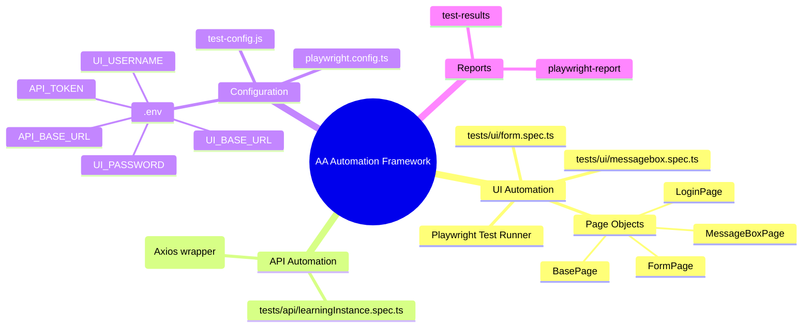

## Automation Anywhere — UI & API Automation Framework

This repository implements the **Automation Assignment – UI & API Testing** against **Automation Anywhere Community Edition** using **Playwright + TypeScript** and the **Page Object Model (POM)** pattern.

The target application is: `https://www.automationanywhere.com/products/enterprise/community-edition`  
You must register your own Community Edition account and use your own credentials locally (no credentials are committed to this repo).

---

## Framework and tools used

- **Test runner / framework**: Playwright (`@playwright/test`) with TypeScript.
- **Design pattern**: Page Object Model (POM) for all UI flows.
- **HTTP client (API tests)**: Axios, wrapped by `ApiClient`.
- **Environment management**: `dotenv` with `.env` file (not committed).

---

## Project structure & use case mapping

- **UI tests** (`tests/ui`)
  - `messagebox.spec.ts` — **Use Case 1: Message Box Task (UI Automation)**
    - Logs in, navigates to `Automation`, creates a **Task Bot**, adds a **Message Box** action, verifies UI elements on the right panel, and saves.
    - Asserts:
      - **UI element visibility** (menus, create dropdown, task form, actions panel, right panel fields).
      - **Proper data entry** (task name, description, message box text).
      - **Successful creation** and confirmation messages.
      - **End‑to‑end functional flow** by asserting the created task appears in the list.
  - `form.spec.ts` — **Use Case 2: Form with Upload Flow (UI Automation)**
    - Logs in, navigates to `Automation`, creates a **Form**, drags **Textbox** and **Select File** onto the canvas, configures them, enters text, uploads a file, and saves.
    - Asserts:
      - **UI element visibility and interactions** (canvas, left toolbox, right properties panel).
      - **Textbox input interaction** and value entry.
      - **File upload control visibility and behavior**, upload success indicators.
      - **Form creation and listing** (form visible by name after save).
- **API tests** (`tests/api`)
  - `learningInstance.spec.ts` — **Use Case 3: Learning Instance API Flow (API Automation)**
    - Uses an authenticated **API token** to call Learning Instance APIs discovered via the browser Network tab.
    - Creates a learning instance and validates:
      - **HTTP status codes** (expects 200/201 and 2xx ranges).
      - **Response time** (validated to be under a defined threshold).
      - **Response body schema & field‑level checks** (e.g. `id`, `name`, `status`, timestamps).
      - **Functional accuracy** by fetching the created instance back and comparing fields.
- **Page Objects** (`src/pages`)
  - `LoginPage.ts` — shared login flow + flexible assertions to confirm the user is logged in.
  - `MessageBoxPage.ts` — encapsulates **Use Case 1** interactions:
    - Navigation to Automation, open **Create → Task Bot**, task details, actions panel, message box configuration, save & confirmation checks.
  - `FormPage.ts` — encapsulates **Use Case 2** interactions:
    - Navigation to Automation, open **Create → Form**, form details, drag‑and‑drop Textbox and File Upload, right‑panel configuration, text entry, file upload, save & verification.
  - `BasePage.ts` — common helpers and base functionality for all page objects.
- **API client** (`src/api/apiClient.ts`)
  - `ApiClient` wraps Axios with base URL, authorization header, JSON content type, and timeout.

---

## High-level architecture (mind map style)

Conceptual view of how the pieces fit together:



Reading this from the center out:
- **Tests** drive the flows (UI specs and API specs).
- **Page Objects** and **ApiClient** encapsulate interaction details.
- **Configuration** wires tests to your actual Automation Anywhere tenant.
- **Reports** capture what happened after each run.

---

## System design (component view)

At a high level, the framework is a small test system with clear layers:

```mermaid
flowchart LR
  subgraph Runner[Playwright Test Runner]
    TUI[UI Specs<br/>tests/ui/*]
    TAPI[API Specs<br/>tests/api/*]
  end

  subgraph UI[UI Layer]
    POLogin[LoginPage.ts]
    POMessage[MessageBoxPage.ts]
    POForm[FormPage.ts]
    POBase[BasePage.ts]
  end

  subgraph API[API Layer]
    Client[ApiClient.ts<br/>(Axios wrapper)]
  end

  subgraph Config[Configuration]
    Env[.env<br/>UI_BASE_URL, API_BASE_URL, creds, token]
    PWCfg[playwright.config.ts]
  end

  subgraph Target[Automation Anywhere Cloud]
    UIApp[Web UI<br/>(Community Edition)]
    REST[Learning Instance APIs]
  end

  TUI --> POLogin
  TUI --> POMessage
  TUI --> POForm

  TAPI --> Client

  POLogin --> UIApp
  POMessage --> UIApp
  POForm --> UIApp

  Client --> REST

  Env --> Runner
  Env --> Client
  PWCfg --> Runner
```

**Design principles:**
- **Separation of concerns**: Specs describe scenarios; page objects / `ApiClient` handle low-level interactions.
- **Configurability**: Environment-specific details live in `.env`, so the same code can run against different tenants.
- **Reusability**: Common logic is centralized in `BasePage` and `ApiClient`.

---

## Environment / configuration notes

- **Environment variables** (loaded by `dotenv`):
  - `UI_BASE_URL` — Automation Anywhere UI base URL (Community Edition URL after login redirect).
  - `UI_USERNAME` / `UI_PASSWORD` — your Automation Anywhere credentials.
  - `API_BASE_URL` — base URL for the Learning Instance APIs.
  - `API_TOKEN` — bearer token used for authenticated Learning Instance API calls.
- **How to configure**:
  - Create a `.env` file in the project root with the above keys.
  - Do **not** commit real credentials or tokens.
  - Helper docs in the repo (`*_SETUP.md`, `ENV_CONFIGURATION_GUIDE.md`, etc.) explain how to locate the correct URLs and tokens via the browser Network tab and Automation Anywhere UI.

---

## Setup

1. **Clone the repository**
2. **Create environment file**
   - Copy any example/env guidance into `.env` and fill in:
     - `UI_BASE_URL`, `UI_USERNAME`, `UI_PASSWORD`
     - `API_BASE_URL`, `API_TOKEN`
3. **Install Node.js** (if not already installed)
   - **macOS (example)**:
     ```bash
     brew install node
     ```
   - **Windows (example)**:
     - Install **Node.js LTS** from the official website (`https://nodejs.org`).
     - During installation, allow it to add Node and npm to your `PATH`.
4. **Install project dependencies and Playwright browsers**
   - macOS / Linux:
     ```bash
     cd "/Users/manjunathkg/Documents/Source Code/Automation Assignment – UI & API Testing"
     npm install
     npx playwright install
     ```
   - Windows (PowerShell or Command Prompt):
     ```bash
     cd "C:\path\to\Automation Assignment – UI & API Testing"
     npm install
     npx playwright install
     ```

### Local-only npm usage (no global installs required)

- The project is configured so that accidental `npm install -g` installs are redirected into a project‑local directory via `.npmrc`.
- Prefer:
  - `npx playwright ...`
  - `npm run <script>`
  - or `npm exec` for any binaries in `node_modules/.bin`.

---

## Running the tests (execution instructions)

- **All tests (UI + API)**:
  ```bash
  npm test
  ```
- **UI tests only** (Use Cases 1 & 2):
  ```bash
  npm run test:ui
  ```
- **API tests only** (Use Case 3):
  ```bash
  npm run test:api
  ```

Each UI spec uses the **POM classes** under `src/pages` and asserts:
- **UI element visibility and interaction**
- **Functional flows and expected behaviors**
- **Successful creation / confirmation messages**

The API spec asserts:
- **HTTP status codes** (2xx, with preference for `201 Created` where applicable)
- **Response time** (bounded by a maximum threshold)
- **Response body schema and field‑level correctness**
- **Functional accuracy** by validating the created Learning Instance via a follow‑up `GET` call.

---

## End‑to‑end flows (flow charts)

### UI flows (Use Cases 1 & 2)

```mermaid
flowchart TD
  A[Start Playwright test] --> B[Load UI_BASE_URL]
  B --> C[LoginPage.login(UI_USERNAME, UI_PASSWORD)]
  C --> D[LoginPage.expectLoggedIn()]

  %% Use Case 1: Message Box Task
  D --> E1[MessageBoxPage.navigateToAutomation()]
  E1 --> F1[openCreateTaskBot()]
  F1 --> G1[fillTaskDetails()]
  G1 --> H1[addMessageBoxAction()]
  H1 --> I1[verifyRightPanelElements()]
  I1 --> J1[configureMessageBox()]
  J1 --> K1[saveConfiguration()]
  K1 --> L1[Assert task visible in list]

  %% Use Case 2: Form with Upload
  D --> E2[FormPage.navigateToAutomation()]
  E2 --> F2[openCreateForm()]
  F2 --> G2[fillFormDetails()]
  G2 --> H2[dragDropTextbox() & dragDropSelectFile()]
  H2 --> I2[clickElementAndVerifyRightPanel()]
  I2 --> J2[enterTextInTextbox()]
  J2 --> K2[uploadDocument(sample.txt)]
  K2 --> L2[saveForm()]
  L2 --> M2[Assert form & uploaded file visible]
```

### API flow (Use Case 3)

```mermaid
flowchart TD
  A[Start API test] --> B[Create ApiClient(API_BASE_URL, API_TOKEN)]
  B --> C[Optional: Verify auth via GET /learning-instances]
  C --> D[POST /learning-instances with payload]
  D --> E[Measure status code and response time]
  E --> F[Validate response body: id, name, status, timestamps]
  F --> G[GET /learning-instances/{id}]
  G --> H[Assert fetched instance matches created instance]
  H --> I[Finish test]
```

---

## Design notes

- **POM‑driven UI tests**: all selectors and user actions are encapsulated in page object classes; specs only orchestrate flows and assertions.
- **Resilient selectors**: selectors are written to be tolerant of minor UI changes in Automation Anywhere (e.g., flexible text and attribute matches).
- **Strong assertions**: extensive use of Playwright `expect` for:
  - visibility, enabled/disabled states, URLs, and text content in UI tests
  - HTTP status, timing, and JSON schema properties in API tests.
- **Environment-driven configuration**: URLs, credentials, and tokens are never hard‑coded and are supplied via environment variables.
- **Reusable API client**: `ApiClient` centralizes headers, base URL, timeouts, and request helpers for consistent API behavior.

---

## Notes and potential next steps

- The flows are implemented to match the **assignment steps** as closely as possible; selectors may need minor tuning based on exact tenant markup.
- Potential improvements:
  - Add CI (GitHub Actions) to execute `npm test` on push/PR.
  - Introduce schema validation tooling (e.g. `zod`) for stricter API contracts.
  - Extend coverage to negative cases and edge‑case behaviors for each use case.
